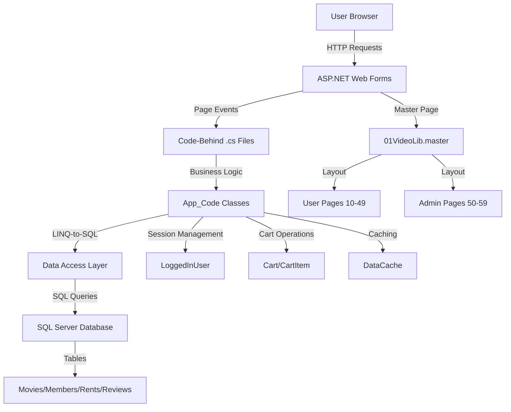
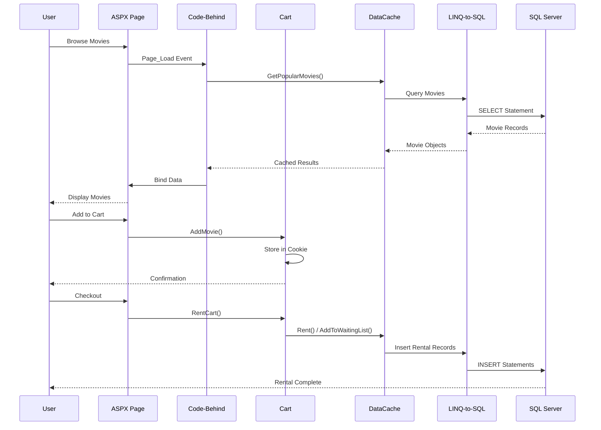
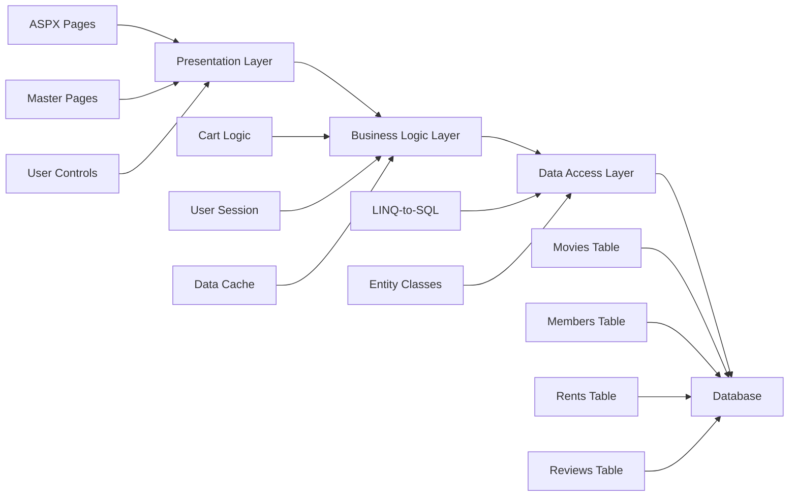

# Hitech Buster Class Msdn Final Course Project

Hitech Buster is a full-featured video rental library management system inspired by Blockbuster, built as a final course project using ASP.NET Web Forms and C#.

Built in December 2009, it supports member subscriptions, movie browsing, rentals, reviews, and waiting lists, alongside a complete admin panel for inventory and reporting. The system demonstrates layered architecture with LINQ-to-SQL, SQL Server integration, session management, caching, and cart-based checkout, showcasing a realistic end-to-end enterprise web application from its 2009 development era.

## Features

### 🎬 Member Features

- 🔐 User registration and authentication
- 📊 Personal dashboard with rental statistics
- 🛒 Shopping cart for movie selection
- 🎥 Browse movies by category and popularity
- ⭐ View and submit movie reviews
- 📝 View rental history and currently rented movies
- ⏳ Join waiting lists for unavailable movies
- 💳 Add subscription days to account
- 🎯 Get personalized movie recommendations

### 👨‍💼 Administrative Features

- ➕ Add new movies to the catalog
- 📀 Manage movie copies and inventory
- 🗑️ Remove movies from the system
- 📈 View rental activity reports
- ⚠️ Track past due rentals
- 📊 Identify movies with long waiting lists
- 💤 Monitor inactive movies and renters
- 📅 Monthly rental statistics

### Core Capabilities

- **Member Management**: Registration, authentication, and subscription tracking
- **Movie Catalog**: Browsing, searching, and detailed movie information
- **Rental System**: Shopping cart, checkout, and rental history
- **Review System**: Movie ratings and user comments
- **Waiting Lists**: Queue management for unavailable movies
- **Admin Dashboard**: Inventory management and reporting

### Technical Excellence

- **Layered Architecture**: Presentation, Business Logic, and Data Access Layers
- **LINQ-to-SQL**: Object-relational mapping for database operations
- **Session Management**: User authentication and state management
- **Data Caching**: Performance optimization through in-memory caching
- **SQL Server Integration**: Robust database backend

### Developer Experience

- **Master Pages**: Consistent UI/UX across all pages
- **User Controls**: Reusable components like the review form
- **Code-Behind Pattern**: Separation of concerns between UI and logic
- **App_Code Classes**: Centralized business logic and utilities

## Usage

### Member Features

1. **Sign Up / Sign In**: Register as a new member or log in to your existing account
2. **Browse Movies**: View popular movies or browse by category
3. **Movie Details**: Click on a movie to view details, reviews, and add to cart
4. **Shopping Cart**: Manage your cart and proceed to checkout
5. **Profile**: View your rental history, currently rented movies, and add subscription days
6. **Reviews**: Submit reviews for movies you've watched
7. **Waiting Lists**: Join waiting lists for movies that are currently unavailable

### Administrative Features

1. **Add Movies**: Add new movies to the catalog with details and copies
2. **Manage Inventory**: Add or remove movie copies
3. **Remove Movies**: Remove movies from the system
4. **Reports**:
   - View past due rentals
   - Identify movies with long waiting lists
   - Monitor inactive movies
   - Track inactive renters
   - View monthly rental activity

## Available Scripts

### Building the Project

**Build Data Access Layer First:**
Open the solution in Visual Studio, right-click the `Dal` project, and select "Build".

**Build Main Application:**
Right-click the `VideoLib` project and select "Build".

### Running the Application

1. Set `VideoLib` as the startup project
2. Press `F5` or click "Start Debugging" to run

## Architecture Principles

This project follows clean architecture principles:

1. **Separation of Concerns**: Presentation, Business Logic, and Data Access Layers are clearly separated
2. **Reusability**: Master pages and user controls promote code reuse
3. **Maintainability**: Centralized business logic in App_Code classes
4. **Testability**: Separated layers allow for easier unit testing
5. **Data Access**: LINQ-to-SQL provides type-safe database operations
6. **State Management**: Session and cookie-based state management for user and cart data

## Architecture Overview



## Data Flow Diagram



## Component Architecture



## Design Patterns

- **Layered Architecture**: Separation of presentation, business logic, and data access
- **Repository Pattern**: Data access abstracted through LINQ-to-SQL
- **Factory Pattern**: Page and control instantiation through ASP.NET runtime
- **Singleton Pattern**: DataCache for centralized caching
- **Session Façade**: LoggedInUser for simplified session management

## Directory Structure

```
hitech-buster-class-msdn-final-course-project/
├── Dal/                          # Data Access Layer
│   ├── VideoLib.cs              # Entity classes
│   ├── VideoLibDB.designer.cs   # LINQ-to-SQL generated code
│   ├── VideoLibDB.dbml          # LINQ-to-SQL mapping file
│   └── Dal.csproj               # DAL project file
├── VideoLib/                     # Web Application
│   ├── App_Code/                # Business logic classes
│   │   ├── Cart.cs              # Shopping cart implementation
│   │   ├── CartItem.cs          # Cart item model
│   │   ├── DataCache.cs         # Data caching wrapper
│   │   ├── LoggedInUser.cs      # Session management
│   │   └── CurrentTime.cs       # Time utilities
│   ├── App_Themes/              # Theme files
│   │   └── HitechBuster/        # Application theme
│   ├── Bin/                     # Compiled binaries
│   ├── Images/                  # Image assets
│   ├── MoviesPics/              # Movie poster images
│   ├── 01VideoLib.master        # Master page template
│   ├── 10Default.aspx           # Home page
│   ├── 20Sign-In.aspx           # Authentication
│   ├── 30-39*.aspx              # Member profile pages
│   ├── 40-49*.aspx              # Movie details & cart
│   ├── 50-59*.aspx              # Admin pages
│   └── web.config               # Application configuration
├── Film/                        # Movie images and assets
├── README.md                    # This file
├── CONTRIBUTING.md              # Contribution guidelines
├── INSTRUCTIONS.md              # Detailed setup instructions
└── LICENSE                      # MIT License
```

## Getting Started

### Prerequisites

- Visual Studio 2013 or higher (2019/2022 recommended)
- .NET Framework 4.0+
- SQL Server 2008+ (or SQL Server Express)
- IIS or IIS Express (included with Visual Studio)

### Installation

1. Clone the repository:

```bash
git clone https://github.com/orassayag/hitech-buster-class-msdn-final-course-project.git
cd hitech-buster-class-msdn-final-course-project
```

2. Open the solution:
   - Navigate to `VideoLib/` folder
   - Open `VideoLib.sln` in Visual Studio

3. Configure the database:
   - Create a database named `VideoLibDB` in SQL Server
   - Update connection string in `VideoLib/web.config`
   - Update connection string in `Dal/app.config`

4. Build the solution:
   - Build `Dal` project first (Data Access Layer)
   - Build `VideoLib` project (Main Application)

5. Run the application:
   - Press `F5` or click "Start Debugging"
   - The application will open in your default browser

### Configuration

Update the connection string in `VideoLib/web.config`:

```xml
<connectionStrings>
  <add name="VideoLibDBConnectionString"
       connectionString="Data Source=YOUR_SERVER;Initial Catalog=VideoLibDB;Integrated Security=True"
       providerName="System.Data.SqlClient" />
</connectionStrings>
```

## Project Structure

```
hitech-buster-class-msdn-final-course-project/
├── Dal/                          # Data Access Layer
│   ├── VideoLib.cs              # Entity classes
│   ├── VideoLibDB.designer.cs   # LINQ-to-SQL generated code
│   ├── VideoLibDB.dbml          # LINQ-to-SQL mapping file
│   └── Dal.csproj               # DAL project file
├── VideoLib/                     # Web Application
│   ├── App_Code/                # Business logic classes
│   │   ├── Cart.cs              # Shopping cart implementation
│   │   ├── CartItem.cs          # Cart item model
│   │   ├── DataCache.cs         # Data caching wrapper
│   │   ├── LoggedInUser.cs      # Session management
│   │   └── CurrentTime.cs       # Time utilities
│   ├── 01VideoLib.master        # Master page template
│   ├── 10Default.aspx           # Home page
│   ├── 20Sign-In.aspx           # Authentication
│   ├── 30-39*.aspx              # Member profile pages
│   ├── 40-49*.aspx              # Movie details & cart
│   ├── 50-59*.aspx              # Admin pages
│   └── web.config               # Application configuration
├── Film/                        # Movie images and assets
├── README.md                    # This file
├── CONTRIBUTING.md              # Contribution guidelines
├── INSTRUCTIONS.md              # Detailed setup instructions
└── LICENSE                      # MIT License
```

## Page Reference

| Page                                                              | Description                          |
| ----------------------------------------------------------------- | ------------------------------------ |
| `10Default.aspx`                                                  | Home page with popular movies        |
| `20Sign-In.aspx`                                                  | User authentication and registration |
| `30MemberDetails.aspx`                                            | Member profile and statistics        |
| `31AddSubscriptions.aspx`                                         | Add rental days to subscription      |
| `32RentalHistory.aspx`                                            | View past rentals                    |
| `33CurrentlyRented.aspx`                                          | View active rentals                  |
| `34Reviews.aspx`                                                  | View movie reviews                   |
| `35RecommendedForYou.aspx`                                        | Personalized recommendations         |
| `36WaitingList.aspx`                                              | View and manage waiting list entries |
| `38RentStatus.aspx`                                               | Check rental status                  |
| `40MovieDetails.aspx`                                             | Detailed movie information           |
| `41AddToCart.aspx`                                                | Add movie to cart                    |
| `42ShowCart.aspx` # View shopping cart                            |
| `43AddReview.ascx` # Submit movie review (user control)           |
| `50AddMovie.aspx` # Admin: Add new movie                          |
| `51AddMovieCopies.aspx` # Admin: Add movie copies                 |
| `52RemoveMovie.aspx` # Admin: Remove movie                        |
| `53PastDueDate.aspx` # Admin: View overdue rentals                |
| `54MoviesWithLongWaitingList.aspx` # Admin: Popular movies report |
| `55DeadMovies.aspx` # Admin: Inactive movies report               |
| `56InactiveRenters.aspx` # Admin: Inactive members report         |
| `57RentActivityPerMonth.aspx` # Admin: Monthly rental statistics  |

## Technologies Used

### Backend

- **ASP.NET Web Forms** - Server-side web application framework
- **C#** - Primary programming language
- **LINQ-to-SQL** - Object-relational mapping
- **SQL Server** - Relational database management
- **.NET Framework** - Application runtime

### Frontend

- **HTML/CSS** - Structure and styling
- **JavaScript (ES5)** - Client-side interactivity
- **AJAX** (if applicable) - Asynchronous operations

### Development Tools

- **Visual Studio** - Integrated development environment
- **SQL Server Management Studio** - Database administration
- **Git** - Version control

## Key Features Implementation

### Shopping Cart System

- Cookie-based cart persistence
- Add/remove movies
- Update rental duration
- Automatic waiting list handling

### Rental Management

- Subscription day tracking
- Automatic due date calculation
- Waiting list queue system
- Return processing

### Caching Strategy

- In-memory data caching via `DataCache` class
- Reduces database round-trips
- Improves application performance

### Session Management

- User authentication state
- Role-based access control
- Logged-in user tracking

## Best Practices

### Development Best Practices

1. **Layered Architecture**: Maintain clear separation between layers
2. **Reuse Components**: Use master pages and user controls for consistency
3. **Centralize Logic**: Keep business logic in App_Code classes
4. **Type Safety**: Leverage LINQ-to-SQL for type-safe database operations
5. **Caching**: Use DataCache to improve performance

### Security Best Practices

> **Note**: This application was built in 2009 as an educational project. Modern security standards should be implemented before production use.

Recommended updates:

- Implement password hashing (bcrypt/Argon2)
- Add CSRF protection
- Use parameterized queries (already implemented via LINQ)
- Implement HTTPS
- Add input validation and output encoding
- Update authentication to ASP.NET Identity

### Operational Best Practices

1. **Database Backups**: Regularly back up the SQL Server database
2. **Monitoring**: Monitor application performance and error logs
3. **Updates**: Keep .NET Framework and Visual Studio updated
4. **Testing**: Test all features before deploying changes

## Security Considerations

> **Note**: This application was built in 2009 as an educational project. Modern security standards should be implemented before production use.

Recommended updates:

- Implement password hashing (bcrypt/Argon2)
- Add CSRF protection
- Use parameterized queries (already implemented via LINQ)
- Implement HTTPS
- Add input validation and output encoding
- Update authentication to ASP.NET Identity

## Contributing

Contributions are welcome! See [CONTRIBUTING.md](CONTRIBUTING.md) for detailed guidelines on:

- Reporting issues
- Submitting pull requests
- Code style guidelines
- Development workflow

## Support

For questions, issues, or contributions:

- **GitHub Issues**: [https://github.com/orassayag/hitech-buster-class-msdn-final-course-project/issues](https://github.com/orassayag/hitech-buster-class-msdn-final-course-project/issues)
- **Email**: orassayag@gmail.com

## Author

- **Or Assayag** - _Initial work_ - [orassayag](https://github.com/orassayag)
- Or Assayag <orassayag@gmail.com>
- GitHub: https://github.com/orassayag
- StackOverflow: https://stackoverflow.com/users/4442606/or-assayag?tab=profile
- LinkedIn: https://linkedin.com/in/orassayag

## License

This application has an MIT license - see the [LICENSE](LICENSE) file for details.

## Acknowledgments

- Built for educational and research purposes
- Respects robots.txt and implements rate limiting
- Uses user-agent rotation to avoid detection
- Implements polite crawling practices
