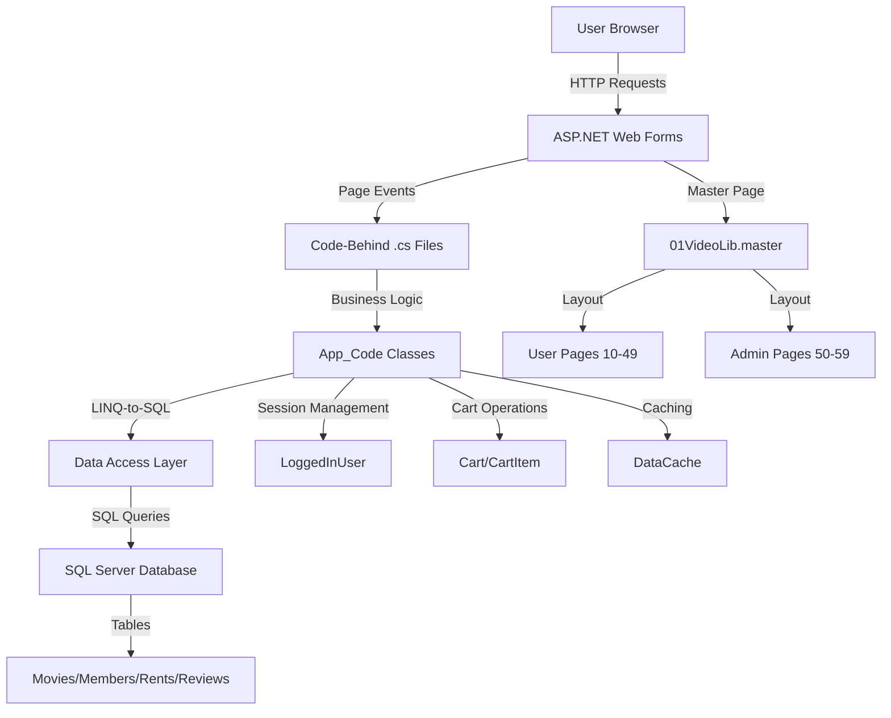
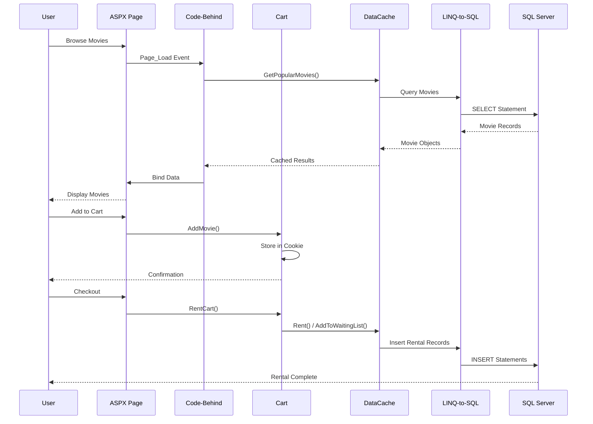
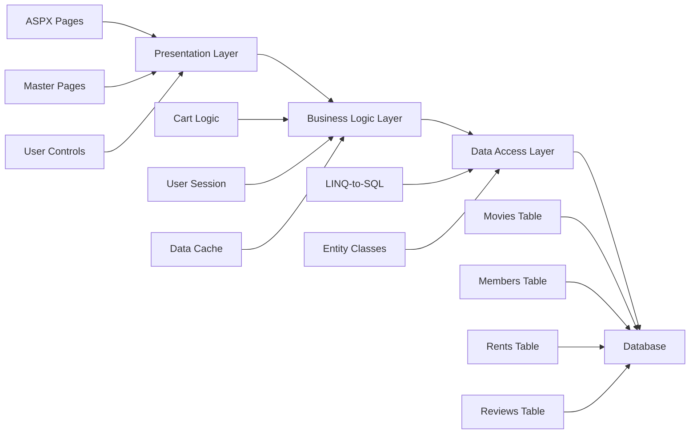

# Hitech Buster - Video Rental Library Management System

A comprehensive video rental library management system built as a final course project. Similar to Blockbuster, this web application manages movie rentals, member subscriptions, waiting lists, reviews, and provides administrative tools for library management.

Built in December 2009. This ASP.NET Web Forms application demonstrates full-stack web development with database integration, user authentication, shopping cart functionality, and business logic implementation.

## Features

### 🎬 Member Features
- 🔐 User registration and authentication
- 📊 Personal dashboard with rental statistics
- 🛒 Shopping cart for movie selection
- 🎥 Browse movies by category and popularity
- ⭐ View and submit movie reviews
- 📝 View rental history and currently rented movies
- ⏳ Join waiting lists for unavailable movies
- 💳 Add subscription days to account
- 🎯 Get personalized movie recommendations

### 👨‍💼 Administrative Features
- ➕ Add new movies to the catalog
- 📀 Manage movie copies and inventory
- 🗑️ Remove movies from the system
- 📈 View rental activity reports
- ⚠️ Track past due rentals
- 📊 Identify movies with long waiting lists
- 💤 Monitor inactive movies and renters
- 📅 Monthly rental statistics

## Architecture Overview



## Data Flow Diagram



## Component Architecture



## Getting Started

### Prerequisites

- Visual Studio 2013 or higher (2019/2022 recommended)
- .NET Framework 4.0+
- SQL Server 2008+ (or SQL Server Express)
- IIS or IIS Express (included with Visual Studio)

### Installation

1. Clone the repository:
```bash
git clone https://github.com/orassayag/hitech-buster-class-msdn-final-course-project.git
cd hitech-buster-class-msdn-final-course-project
```

2. Open the solution:
   - Navigate to `VideoLib/` folder
   - Open `VideoLib.sln` in Visual Studio

3. Configure the database:
   - Create a database named `VideoLibDB` in SQL Server
   - Update connection string in `VideoLib/web.config`
   - Update connection string in `Dal/app.config`

4. Build the solution:
   - Build `Dal` project first (Data Access Layer)
   - Build `VideoLib` project (Main Application)

5. Run the application:
   - Press `F5` or click "Start Debugging"
   - The application will open in your default browser

### Configuration

Update the connection string in `VideoLib/web.config`:

```xml
<connectionStrings>
  <add name="VideoLibDBConnectionString" 
       connectionString="Data Source=YOUR_SERVER;Initial Catalog=VideoLibDB;Integrated Security=True" 
       providerName="System.Data.SqlClient" />
</connectionStrings>
```

## Project Structure

```
hitech-buster-class-msdn-final-course-project/
├── Dal/                          # Data Access Layer
│   ├── VideoLib.cs              # Entity classes
│   ├── VideoLibDB.designer.cs   # LINQ-to-SQL generated code
│   ├── VideoLibDB.dbml          # LINQ-to-SQL mapping file
│   └── Dal.csproj               # DAL project file
├── VideoLib/                     # Web Application
│   ├── App_Code/                # Business logic classes
│   │   ├── Cart.cs              # Shopping cart implementation
│   │   ├── CartItem.cs          # Cart item model
│   │   ├── DataCache.cs         # Data caching wrapper
│   │   ├── LoggedInUser.cs      # Session management
│   │   └── CurrentTime.cs       # Time utilities
│   ├── 01VideoLib.master        # Master page template
│   ├── 10Default.aspx           # Home page
│   ├── 20Sign-In.aspx           # Authentication
│   ├── 30-39*.aspx              # Member profile pages
│   ├── 40-49*.aspx              # Movie details & cart
│   ├── 50-59*.aspx              # Admin pages
│   └── web.config               # Application configuration
├── Film/                        # Movie images and assets
├── README.md                    # This file
├── CONTRIBUTING.md              # Contribution guidelines
├── INSTRUCTIONS.md              # Detailed setup instructions
└── LICENSE                      # MIT License
```

## Page Reference

| Page | Description |
|------|-------------|
| `10Default.aspx` | Home page with popular movies |
| `20Sign-In.aspx` | User authentication and registration |
| `30MemberDetails.aspx` | Member profile and statistics |
| `31AddSubscriptions.aspx` | Add rental days to subscription |
| `32RentalHistory.aspx` | View past rentals |
| `33CurrentlyRented.aspx` | View active rentals |
| `34Reviews.aspx` | View movie reviews |
| `35RecommendedForYou.aspx` | Personalized recommendations |
| `36WaitingList.aspx` | View and manage waiting list entries |
| `38RentStatus.aspx` | Check rental status |
| `40MovieDetails.aspx` | Detailed movie information |
| `41AddToCart.aspx` | Add movie to cart |
| `42ShowCart.aspx` | View shopping cart |
| `43AddReview.ascx` | Submit movie review (user control) |
| `50AddMovie.aspx` | Admin: Add new movie |
| `51AddMovieCopies.aspx` | Admin: Add movie copies |
| `52RemoveMovie.aspx` | Admin: Remove movie |
| `53PastDueDate.aspx` | Admin: View overdue rentals |
| `54MoviesWithLongWaitingList.aspx` | Admin: Popular movies report |
| `55DeadMovies.aspx` | Admin: Inactive movies report |
| `56InactiveRenters.aspx` | Admin: Inactive members report |
| `57RentActivityPerMonth.aspx` | Admin: Monthly rental statistics |

## Technologies Used

### Backend
- **ASP.NET Web Forms** - Server-side web application framework
- **C#** - Primary programming language
- **LINQ-to-SQL** - Object-relational mapping
- **SQL Server** - Relational database management
- **.NET Framework** - Application runtime

### Frontend
- **HTML/CSS** - Structure and styling
- **JavaScript (ES5)** - Client-side interactivity
- **AJAX** (if applicable) - Asynchronous operations

### Development Tools
- **Visual Studio** - Integrated development environment
- **SQL Server Management Studio** - Database administration
- **Git** - Version control

## Key Features Implementation

### Shopping Cart System
- Cookie-based cart persistence
- Add/remove movies
- Update rental duration
- Automatic waiting list handling

### Rental Management
- Subscription day tracking
- Automatic due date calculation
- Waiting list queue system
- Return processing

### Caching Strategy
- In-memory data caching via `DataCache` class
- Reduces database round-trips
- Improves application performance

### Session Management
- User authentication state
- Role-based access control
- Logged-in user tracking

## Security Considerations

> **Note:** This application was built in 2009 as an educational project. Modern security standards should be implemented before production use.

Recommended updates:
- Implement password hashing (bcrypt/Argon2)
- Add CSRF protection
- Use parameterized queries (already implemented via LINQ)
- Implement HTTPS
- Add input validation and output encoding
- Update authentication to ASP.NET Identity

## Contributing

Contributions are welcome! See [CONTRIBUTING.md](CONTRIBUTING.md) for detailed guidelines on:
- Reporting issues
- Submitting pull requests
- Code style guidelines
- Development workflow

## Author

* **Or Assayag** - *Initial work* - [orassayag](https://github.com/orassayag)
* Or Assayag <orassayag@gmail.com>
* GitHub: https://github.com/orassayag
* StackOverflow: https://stackoverflow.com/users/4442606/or-assayag?tab=profile
* LinkedIn: https://linkedin.com/in/orassayag

## License

This project is licensed under the MIT License - see the [LICENSE](LICENSE) file for details.

## Acknowledgments

- Built as a final project for Hitech Buster Class MSDN course
- Demonstrates ASP.NET Web Forms best practices circa 2009
- Educational project showcasing full-stack web development
